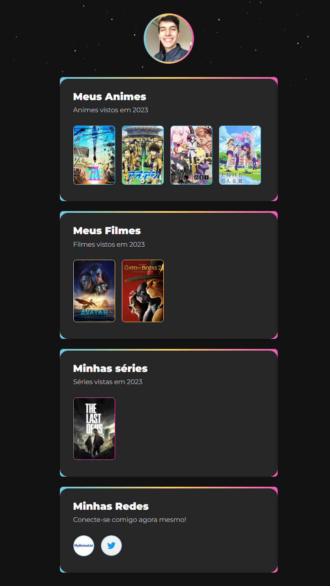

#NLW Desafio eSports

Projeto construído como parte do desafio eSports da Next Level Week da Rocketseat.

[🔍 Clique aqui para acessar](https://jeancdt.github.io/nlw-desafio-esports/)

## ⚙ Tecnologias

- HTML
- CSS
- Git e Github

## 💬 Para que serve o desafio?

- Html
    - Revisar comandos
    - Autônomia

- Css
    - Exercício de memória
    - Relembrar e memorizar comandos
    - Auxiliar em formatação de imagem
    - Auxiliar em animação
    - Autonomia para melhorar do seu jeito

- Git e Github
    - Lembrar conceitos
    - Aprender configurações adicionais

## 🙋🏻‍♂️ Contato

jeancdetoni@gmail.com